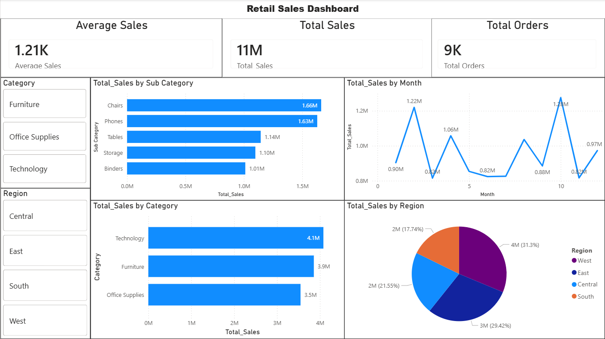

# 📊 Retail Sales Dashboard (Power BI)

## 📌 Overview
This project is part of **Task-3: Dashboard Development** during my Data Analytics Internship at ApexPlanet Software Pvt Ltd.

The objective of this project is to build an **interactive Power BI dashboard** to visualize retail sales data and extract meaningful business insights.

---

## 🎯 Objectives

- Create an interactive dashboard using Power BI
- Visualize key business metrics (KPIs)
- Analyze sales performance across categories, regions, and time
- Provide insights for better decision-making

---

## 🛠️ Tools & Technologies Used

- Power BI
- Python (for data cleaning & EDA)
- Pandas
- GitHub

---

## 📂 Dataset

The dataset used is a cleaned retail dataset from previous tasks containing:

- Order Id
- Order Date
- Category
- Sub Category
- Region
- Quantity
- List Price
- Total Sales

---

## 📊 Dashboard Features

The dashboard includes:

### 🔢 KPIs
- Total Sales
- Total Orders
- Average Sales

### 📈 Visualizations
- Sales by Category (Bar Chart)
- Sales by Region (Pie Chart)
- Monthly Sales Trend (Line Chart)
- Top 5 Sub-Categories by Sales

### 🎛️ Filters (Slicers)
- Category
- Region

---

## 📸 Dashboard Preview

---

## 📈 Key Insights

- 💻 **Technology Category Dominates:**
  - The Technology category contributes the highest share of total sales.

- 🌍 **West Region Leads Sales:**
  - The West region generates the highest revenue among all regions.

- 📅 **Seasonal Trends Observed:**
  - Sales fluctuate monthly, with noticeable peaks during certain periods.

- 🛒 **Top Products Drive Revenue:**
  - A few sub-categories significantly contribute to overall sales.

- 🔗 **Sales Drivers:**
  - Higher quantity orders directly increase total sales, indicating strong volume-based performance.

---

## 📌 Conclusion

This dashboard provides a clear and interactive view of retail business performance.

Key takeaways:
- Data visualization simplifies complex data into actionable insights
- Businesses can focus on high-performing categories and regions
- Identifying trends helps in planning future strategies

This project demonstrates the importance of dashboards in **business intelligence and data-driven decision-making**.

